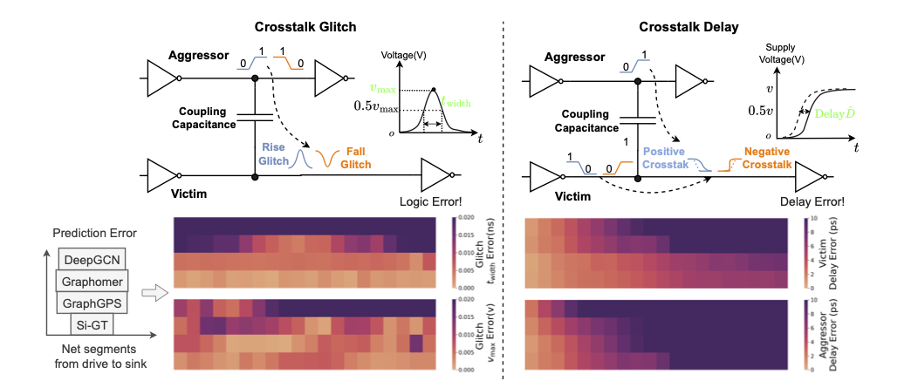
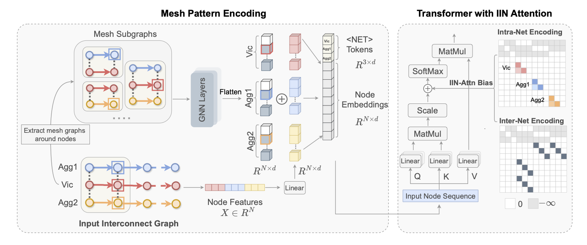

# Si-GT
This repository provides the official implementation of the ICLR 2026 poster ["Si-GT: Fast Interconnect Signal Integrity Analysis for Integrated Circuit Design via Graph Transformers"](https://openreview.net/pdf?id=orO5727bSh).


Si-GT is a graph Transformer model designed for fast interconnect signal integrity analysis in integrated circuit design. It supports two key tasks: **crosstalk delay prediction** and **crosstalk glitch prediction**. For crosstalk delay, Si-GT predicts the net delay on both aggressor and victim nets. For crosstalk glitch, Si-GT predicts the peak noise voltage and noise width.



# Model Overview
Si-GT elaborates three key designs: (1) virtual NET token to encode net-specific signal characteristics and serve as net-wise representation, (2) mesh pattern encoding to embed high-order mesh structures at each node while distinguishing uncoupled wire segments, and (3) intra-inter net (IIN) attention mechanism to capture structures of signal propagation path and coupling connections.



# Dataset Download

The datasets can be downloaded using `gdown`.

```bash
pip install gdown

# Crosstalk delay dataset
gdown 1Ur_CP4HmWD1J5RhOrOpnUPkzXonRwby8 

# Crosstalk glitch dataset
gdown 1h4CUR9rtw7wQRZZ4HGkShd3POhu00vzF
```

# Installation

Install the required packages:

```bash
pip install -r requirements.txt
```

# Model Training

We provide training scripts for crosstalk delay/glitch prediction. The repository includes both conventional GNN models and graph Transformer-based models for comparison.

Supported models include:

- **GNN-based models**: GCN, GAT, GIN, GraphSAGE, and DeepGCN
- **Graph Transformer-based models**: Graphomer, SGFormer, GraphGPS, and Si-GT

The training has two modes:

- `segment`: predict delay/glitch at the segment level
- `sink`: predict delay/glitch at the sink level

Set `vic_only = True` to use only nodes on victim net for training and evaluation. 

## Model Configuration
To change the GNN backbone, set the `gnn_type` parameter in the training script:

```python
gnn_type = "gin"  # options: "gin", "gcn", "gat", "sage"
```

To enable positional encoding, set `pe_type` and provide the corresponding configuration in `cfg`. You can combining multiple positional encodings:
```python
pe_type = ["EquivStableLapPE", "RWSE"]

cfg = {
    "posenc_RWSE": {
        "enable": True,
        "kernel": {
            "times_func": range(1, 17),
            "times": list(range(1, 17)),
        },
        "model": "Linear",
        "dim_pe": 16,
        "raw_norm_type": "BatchNorm",
    },
    "posenc_EquivStableLapPE": {
        "enable": True,
        "eigen": {
            "laplacian_norm": "none",
            "eigvec_norm": "L2",
            "max_freqs": 8,
        },
        "raw_norm_type": "none",
    },
}
```

## Training Command

To train a delay/glitch prediction model, change `model` parameter in the script, then run:

```bash
python crosstalk_delay.py
python crosstalk_glitch.py
```

## Model Testing

We provide two Jupyter notebooks for loading trained checkpoints, running inference, and evaluating model accuracy under different segment lengths:

- `glitch_inference.ipynb`
- `delay_inference.ipynb`
